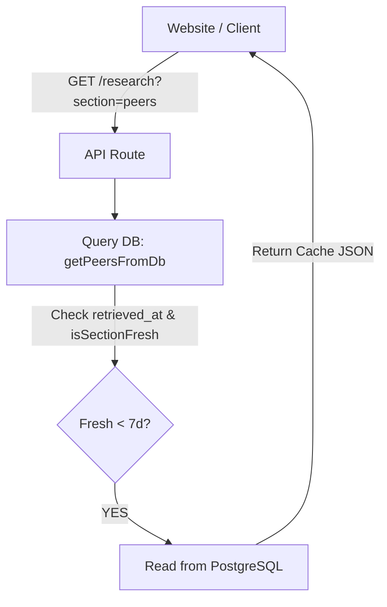
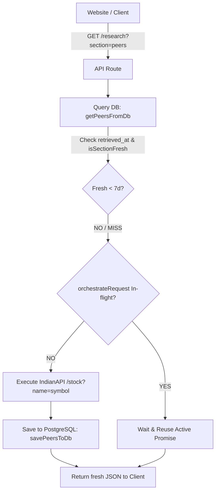
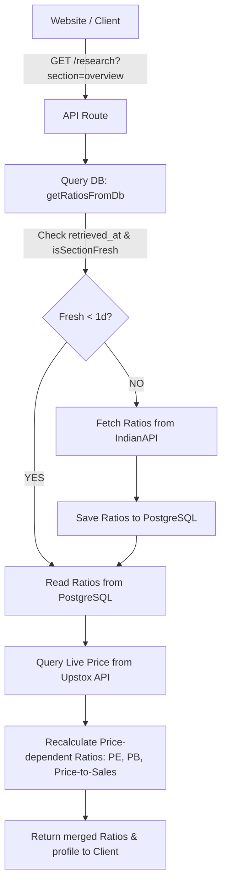
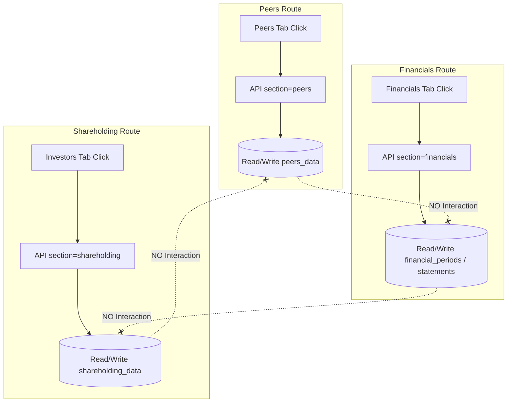

# Stock Detail Cache Schema & Data-Storage Design

This document establishes the official database schema, data structure layouts, and read-through boundary calculation logic for all 8 stock-detail sections of VolumeCall.

---

## 1. Complete Section Map

| Section | Frontend Tab | API Route | IndianAPI Endpoint | Provider Function | Existing DB Location | Proposed DB Location | Data Structure Stored | retrieved_at Field | TTL | Refresh Boundary | Upstox Trigger? | Data Category | Unrelated Section Trigger? |
|---|---|---|---|---|---|---|---|---|---|---|---|---|---|
| **Peers** | Peers | `/api/stocks/[symbol]/research?section=peers` | `/stock?name=<symbol>` | `getIndianCompanyDetails(symbol)` | None | `companies.peers_data` | `{ peers: NormalizedPeerItem[], medians: Medians }` | `peers_retrieved_at` | 7 days | 9:15 AM IST | YES (isin resolution fallback) | Current | NO |
| **Quarterly Results** | Quarterly Results | `/api/stocks/[symbol]/research?section=financials` | `/historical_stats?stats=quarter_results` | `getIndianFinancialStats(symbol, "quarter_results")` | `financial_periods` | `financial_periods` (reused) | Rows with `type = 'QUARTERLY'` | `retrieved_at` | 7 days | 9:15 AM IST | NO | Historical | NO |
| **Profit & Loss** | Profit & Loss | `/api/stocks/[symbol]/research?section=financials` | `/historical_stats?stats=yoy_results` | `getIndianFinancialStats(symbol, "yoy_results")` | `financial_periods` | `financial_periods` (reused) | Rows with `type = 'ANNUAL'` | `retrieved_at` | 7 days | 9:15 AM IST | NO | Historical | NO |
| **Balance Sheet** | Balance Sheet | `/api/stocks/[symbol]/research?section=financials` | `/historical_stats?stats=balancesheet` | `getIndianFinancialStats(symbol, "balancesheet")` | `balance_sheets` | `balance_sheets` (reused) | Rows in `balance_sheets` table | `retrieved_at` | 90 days | 9:15 AM IST | NO | Historical | NO |
| **Cash Flow** | Cash Flow | `/api/stocks/[symbol]/research?section=financials` | `/historical_stats?stats=cashflow` | `getIndianFinancialStats(symbol, "cashflow")` | `cash_flows` | `cash_flows` (reused) | Rows in `cash_flows` table | `retrieved_at` | 90 days | 9:15 AM IST | NO | Historical | NO |
| **Investors / Shareholding** | Investors | `/api/stocks/[symbol]/research?section=shareholding` | `/historical_stats?stats=shareholding_pattern_quarterly` | `getIndianFinancialStats(symbol, "shareholding_pattern_quarterly")` | None | `companies.shareholding_data` | `NormalizedShareholdingQuarter[]` | `shareholding_retrieved_at` | 7 days | 9:15 AM IST | NO | Historical | NO |
| **Documents** | Documents | `/api/stocks/[symbol]/research?section=overview` | `/stock?name=<symbol>` | `getIndianCompanyDetails(symbol)` | None | `companies.corporate_actions`, `companies.announcements` | `NormalizedCorporateAction[]` & `NormalizedAnnouncement[]` | `documents_retrieved_at` | 30 days | 9:15 AM IST | NO | Historical | NO |
| **Ratios** | Ratios | `/api/stocks/[symbol]/research?section=overview` | `/stock?name=<symbol>` | `getIndianCompanyDetails(symbol)` | None | `companies.ratios_data` | `NormalizedRatios` | `ratios_retrieved_at` | 1 day | 9:15 AM IST | YES (live price recalculation) | Current | NO |
| **Live Price** | Page Header / Quote Card | Handled via page load / details component | N/A | Upstox Service (live quote) | None | N/A (real-time stream) | N/A | N/A | Real-time | Market hours | YES (Upstox primary) | Real-time | NO |

---

## 2. Database Schema Design

### Current Schema Definitions (from `scripts/migrate.js`)

```sql
CREATE TABLE IF NOT EXISTS companies (
  id SERIAL PRIMARY KEY,
  symbol VARCHAR(20) UNIQUE NOT NULL,
  name VARCHAR(255) NOT NULL,
  isin VARCHAR(20) NOT NULL,
  sector VARCHAR(100),
  industry VARCHAR(100),
  description TEXT,
  website VARCHAR(255),
  logo_url VARCHAR(512),
  updated_at TIMESTAMP WITH TIME ZONE DEFAULT CURRENT_TIMESTAMP
);

CREATE TABLE IF NOT EXISTS financial_periods (
  id SERIAL PRIMARY KEY,
  company_id INTEGER REFERENCES companies(id) ON DELETE CASCADE NOT NULL,
  type VARCHAR(20) NOT NULL CHECK (type IN ('QUARTERLY', 'ANNUAL')),
  period VARCHAR(20) NOT NULL,
  sales NUMERIC,
  expenses NUMERIC,
  operating_profit NUMERIC,
  opm_percent NUMERIC,
  other_income NUMERIC,
  interest NUMERIC,
  depreciation NUMERIC,
  profit_before_tax NUMERIC,
  tax_percent NUMERIC,
  net_profit NUMERIC,
  eps NUMERIC,
  source VARCHAR(50) NOT NULL,
  retrieved_at TIMESTAMP WITH TIME ZONE DEFAULT CURRENT_TIMESTAMP,
  CONSTRAINT uq_financial_periods UNIQUE (company_id, type, period)
);

CREATE TABLE IF NOT EXISTS balance_sheets (
  id SERIAL PRIMARY KEY,
  company_id INTEGER REFERENCES companies(id) ON DELETE CASCADE NOT NULL,
  period VARCHAR(20) NOT NULL,
  equity_capital NUMERIC,
  reserves NUMERIC,
  borrowings NUMERIC,
  other_liabilities NUMERIC,
  total_liabilities NUMERIC,
  fixed_assets NUMERIC,
  cwip NUMERIC,
  investments NUMERIC,
  other_assets NUMERIC,
  total_assets NUMERIC,
  source VARCHAR(50) NOT NULL,
  retrieved_at TIMESTAMP WITH TIME ZONE DEFAULT CURRENT_TIMESTAMP,
  CONSTRAINT uq_balance_sheets UNIQUE (company_id, period)
);

CREATE TABLE IF NOT EXISTS cash_flows (
  id SERIAL PRIMARY KEY,
  company_id INTEGER REFERENCES companies(id) ON DELETE CASCADE NOT NULL,
  period VARCHAR(20) NOT NULL,
  operating_cash_flow NUMERIC,
  investing_cash_flow NUMERIC,
  financing_cash_flow NUMERIC,
  net_cash_flow NUMERIC,
  source VARCHAR(50) NOT NULL,
  retrieved_at TIMESTAMP WITH TIME ZONE DEFAULT CURRENT_TIMESTAMP,
  CONSTRAINT uq_cash_flows UNIQUE (company_id, period)
);
```

### Proposed Schema Alterations (Idempotent Migration)

We will modify the `companies` table using `ALTER TABLE ... ADD COLUMN IF NOT EXISTS` to store the remaining unpersisted sections:

```sql
ALTER TABLE companies 
ADD COLUMN IF NOT EXISTS peers_data JSONB,
ADD COLUMN IF NOT EXISTS peers_retrieved_at TIMESTAMP WITH TIME ZONE,
ADD COLUMN IF NOT EXISTS shareholding_data JSONB,
ADD COLUMN IF NOT EXISTS shareholding_retrieved_at TIMESTAMP WITH TIME ZONE,
ADD COLUMN IF NOT EXISTS corporate_actions JSONB,
ADD COLUMN IF NOT EXISTS announcements JSONB,
ADD COLUMN IF NOT EXISTS documents_retrieved_at TIMESTAMP WITH TIME ZONE,
ADD COLUMN IF NOT EXISTS ratios_data JSONB,
ADD COLUMN IF NOT EXISTS ratios_retrieved_at TIMESTAMP WITH TIME ZONE;
```

#### Rationale for Added Fields:
1. **`peers_data` & `peers_retrieved_at`**: Saves the resolved peers list (with verified symbols, ISINs, prices, and medians calculated from Upstox lookup fallbacks) to prevent multi-peer parallel crawl amplification.
2. **`shareholding_data` & `shareholding_retrieved_at`**: Preserves the complete historical shareholder distribution percentages (promoters, FIIs, DIIs, public) required by the Investors quarters chart and tables.
3. **`corporate_actions` & `announcements` & `documents_retrieved_at`**: Documents tab displays two distinct arrays returned by `/stock?name=<symbol>` (corporate actions andLatest Announcements). We store them in separate JSONB columns within the `companies` row for structural clarity, but share a single timestamp (`documents_retrieved_at`) since they originate from the same provider call.
4. **`ratios_data` & `ratios_retrieved_at`**: Saves the fundamental ratio values returned by IndianAPI (such as EV/EBITDA, Solvency current/quick ratios, and profitability metrics) to enforce daily refresh policies.

---

## 3. Data Structure Examples

### 1. `peers_data`
```json
{
  "peers": [
    {
      "symbol": "TCS",
      "isin": "INE467B01029",
      "name": "Tata Consultancy Services Ltd.",
      "price": 3850.5,
      "marketCap": 1390450.2,
      "pe": 28.5,
      "pb": 8.2,
      "roe": 32.1,
      "roce": 45.4,
      "debtToEquity": 0.02
    }
  ],
  "medians": {
    "pe": 28.5,
    "pb": 8.2,
    "roe": 32.1,
    "roce": 45.4,
    "debtToEquity": 0.02
  }
}
```

### 2. `shareholding_data`
```json
[
  {
    "period": "Jun 2025",
    "promoter": 72.84,
    "fii": 12.54,
    "dii": 8.12,
    "public": 6.5,
    "pledgedPercent": 0.0
  }
]
```

### 3. `ratios_data`
```json
{
  "pe": 24.5,
  "pb": 5.4,
  "evebitda": 15.2,
  "priceToSales": 3.8,
  "dividendYield": 1.25,
  "roe": 22.4,
  "roce": 28.1,
  "roa": 14.5,
  "debtToEquity": 0.15,
  "currentRatio": 1.8,
  "quickRatio": 1.4,
  "interestCoverage": 12.5
}
```

### 4. `corporate_actions`
```json
[
  {
    "type": "DIVIDEND",
    "detail": "Interim Dividend Rs 10.00 Per Share",
    "exDate": "2026-05-15T00:00:00.000Z"
  }
]
```

### 5. `announcements`
```json
[
  {
    "category": "General",
    "title": "Press Release on Q1 Earnings Results",
    "date": "2026-08-10T11:51:20.000Z",
    "sourceUrl": "https://example.com/bse/announcement.pdf"
  }
]
```

---

## 4. Financial Table Mapping

The IndianAPI historical stats responses are mapped into rows within the respective tables:

### 1. `quarter_results` → `financial_periods`
* `stats` endpoint payload row elements maps into `financial_periods` with `type = 'QUARTERLY'`.
* **Field Mapping**:
  - `sales` → `sales`
  - `expenses` → `expenses`
  - `operatingprofit` → `operating_profit`
  - `opm` → `opm_percent`
  - `otherincome` → `other_income`
  - `interest` → `interest`
  - `depreciation` → `depreciation`
  - `profitbeforetax` → `profit_before_tax`
  - `tax` → `tax_percent`
  - `netprofit` → `net_profit`
  - `eps` → `eps`

### 2. `yoy_results` → `financial_periods`
* Maps into `financial_periods` with `type = 'ANNUAL'`. Same field mapping as above.

### 3. `balancesheet` → `balance_sheets`
* **Field Mapping**:
  - `sharecapital` → `equity_capital`
  - `reserves` → `reserves`
  - `borrowings` → `borrowings`
  - `otherliabilities` → `other_liabilities`
  - `totalliabilities` → `total_liabilities`
  - `fixedassets` → `fixed_assets`
  - `cwip` → `cwip`
  - `investments` → `investments`
  - `otherassets` → `other_assets`
  - `totalassets` → `total_assets`

### 4. `cashflow` → `cash_flows`
* **Field Mapping**:
  - `operatingcashflow` → `operating_cash_flow`
  - `investingcashflow` → `investing_cash_flow`
  - `financingcashflow` → `financing_cash_flow`
  - `netcashflow` → `net_cash_flow`

---

## 5. TTL / Refresh Calculation

### Freshness Rules
All expiration calculations are based on the next daily boundary of **9:15 AM Asia/Kolkata (IST)**:

* **1-Day TTL (Ratios)**: Expire on the next daily 9:15 AM boundary.
* **7-Day TTL (Peers, Quarterly, P&L, Shareholdings)**: Expire on the 7th daily 9:15 AM boundary.
* **30-Day TTL (Documents)**: Expire on the 30th daily 9:15 AM boundary.
* **90-Day TTL (Balance Sheet, Cash Flow)**: Expire on the 90th daily 9:15 AM boundary.

### Expiry Logic Examples (Data Fetched Monday at 1:00 PM IST)
* **1 Day**: Monday 1:00 PM IST → Expires **Tuesday 9:15 AM IST**.
* **7 Days**: Monday 1:00 PM IST → Expires **Next Monday 9:15 AM IST**.
* **30 Days**: August 10 1:00 PM IST → Expires **September 9 9:15 AM IST**.
* **90 Days**: January 10 1:00 PM IST → Expires **April 10 9:15 AM IST**.

---

## 6. Before/After 9:15 AM IST Edge Case

If data is retrieved **before 9:15 AM IST** on a given day (e.g. Monday 9:00 AM IST):
* The reference daily boundary rolls back to the previous day (**Sunday 9:15 AM IST**).
* **Resulting Expiration Times**:
  - **1 Day (Ratios)**: Sunday 9:15 AM IST + 1 day = **Monday 9:15 AM IST** (expires in 15 minutes). This is correct, as it forces ratios to update after the daily pre-market open threshold.
  - **7 Days (Peers/Quarters)**: Sunday 9:15 AM IST + 7 days = **Sunday 9:15 AM IST of next week**.
  - **30 Days**: Sunday 9:15 AM IST + 30 days = **30th day 9:15 AM IST**.
  - **90 Days**: Sunday 9:15 AM IST + 90 days = **90th day 9:15 AM IST**.

---

## 7. Section Independence Rules

Every section functions independently on cache checks. There are no cascading triggers.
* **Peers Cache Miss**: Triggers API lookup for Peers list and resolved competitor prices/medians only. Does **not** request Balance Sheets, Shareholding Quarters, or Documents.
* **Ratios Cache Miss**: Calls IndianAPI details to reload fundamental ratios. RECUPERATES P/E, P/B, and Price-to-Sales using latest Upstox quotes. Does **not** trigger P&L or Peer metrics resolution.
* **Balance Sheet Stale**: Fetches financials, but only writes to the statements tables.

---

## 8. Live Price Isolation

* Real-time metrics are never stored in the database.
* Upstox is the exclusive source for live/delayed pricing during trading sessions.
* IndianAPI is never called just to fetch current stock prices.
* **Recalculations**: For Ratios (P/E, P/B, Price-to-Sales) and Peers (Prices), the underlying fundamental values stored in PostgreSQL are merged with live Upstox prices to calculate values dynamically on-the-fly.

---

## 9. Request Flow Diagrams

### A. Fresh Cache Hit


### B. Stale Cache / Miss


### C. Live Price Recalculation


### D. Section Independence


---

## 10. Failure Safety Rules
1. **Preserve Cache**: If an IndianAPI request fails, never overwrite existing PostgreSQL columns/rows with null or empty arrays.
2. **Graceful Fallback**: Serve the stale PostgreSQL snapshot to the client with logging indicating refresh failure.
3. **Retry State**: Do not update `retrieved_at` timestamps on failures, ensuring the cache remains stale and eligible for retry on next load.

---

## 11. Concurrency Protection
To prevent duplicate API crawls:
* We leverage the map-based `StockDataService.orchestrateRequest` helper.
* Key: `fetch:${symbol}:${section}`.
* Concurrent requests are queued and resolve to a single shared in-flight IndianAPI fetch.

---

## 12. Migration Safety
1. **No Destructive Action**: Alter queries use `ADD COLUMN IF NOT EXISTS` to avoid resetting existing company metadata.
2. **Backward Compatibility**: Existing database rows remain valid after migration; missing cache cells will simply be treated as cache misses and populated dynamically.

---

## 13. Implementation Checklist

- [ ] Run column migration `ALTER TABLE companies ADD COLUMN IF NOT EXISTS ...`
- [ ] Create centralized TTL utility helper `src/lib/stocks/ttl.ts` with 9:15 AM boundary logic
- [ ] Add `getPeersFromDb` / `savePeersToDb` helpers in `src/lib/db/services.ts`
- [ ] Add `getShareholdingFromDb` / `saveShareholdingToDb` helpers in `src/lib/db/services.ts`
- [ ] Add `getDocumentsFromDb` / `saveDocumentsToDb` helpers in `src/lib/db/services.ts`
- [ ] Add `getRatiosFromDb` / `saveRatiosToDb` helpers in `src/lib/db/services.ts`
- [ ] Add `getFinancialsRetrievalTime` and independent table readers in `src/lib/db/services.ts`
- [ ] Update `src/app/api/stocks/[symbol]/research/route.ts` to implement independent read-through paths
- [ ] Implement price-dependent recalculations for Ratios using Upstox Quote API
- [ ] Integrate concurrent request locks using `orchestrateRequest`
- [ ] Run `npm run lint` and verify typescript compiler
- [ ] Run `npm run build` and ensure Next.js outputs dynamic research paths

---

## 14. Cache Architecture Diagram

```text
                     ===================================================
                                         VOLUMECALL
                     ===================================================
                                             │
                                          Next.js
                                             │
                                             ▼
                             [ API Route (/api/stocks/[symbol]/research) ]
                                             │
                                     (Query Parameter: section=...)
                                             │
                       ┌─────────────────────┼─────────────────────┐
                       ▼                     ▼                     ▼
                  [ section=financials ]   [ section=overview ]  [ section=peers ]
                       │                     │                     │
                       │                     ├────────────────┐    │
                       │                     │                │    │
                       ▼                     ▼                ▼    ▼
                 PostgreSQL (Neon)      PostgreSQL        PostgreSQL
                       │                     │                │
               Check Freshness?       Check Freshness?   Check Freshness?
               (90d BS/CF, 7d PL)       (1d Ratios)       (7d Peers)
                 /           \            /       \        /       \
              [YES]          [NO]      [YES]      [NO]  [YES]      [NO]
               /               \        /          \     /          \
        Read PostgreSQL        │  Read PostgreSQL  │ Read PostgreSQL │
               │               ▼        │          ▼     │          ▼
               │          IndianAPI     │     IndianAPI  │     IndianAPI
               │         (historical)   │     (profile)  │     (profile)
               │               │        │          │     │          │
               │         Save to Neon   │     Save to DB │     Save to DB
               │               │        │          │     │          │
               └──────┬────────┘        └─────┬────┘     └─────┬────┘
                      │                       │                │
                      │                       ▼                │
                      │               Upstox Price Query       │
                      │                (Live Market Price)     │
                      │                       │                │
                      │               Recalculate ratios       │
                      │               (PE, PB, Price/Sales)    │
                      │                       │                │
                      ▼                       ▼                ▼
             [ quarterlyResults ]       [ ratios_data ]   [ peers_data ]
             [ annualProfitLoss ]       [ corporate_actions ]
             [ balanceSheet ]           [ announcements ]
             [ cashFlow ]
```

